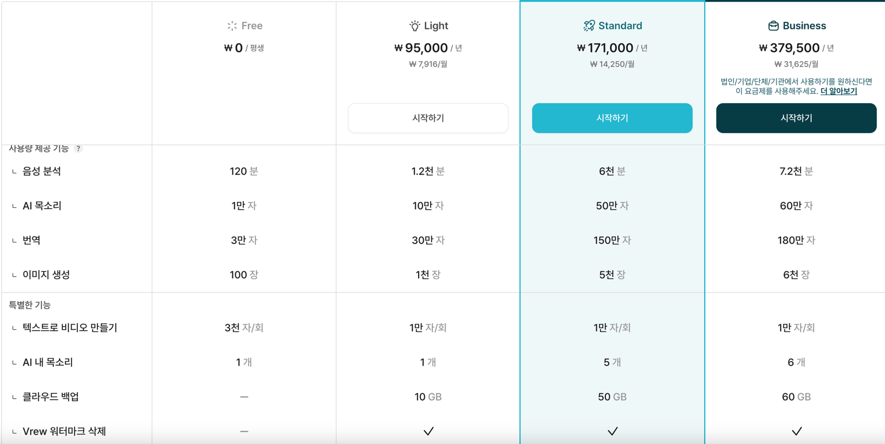
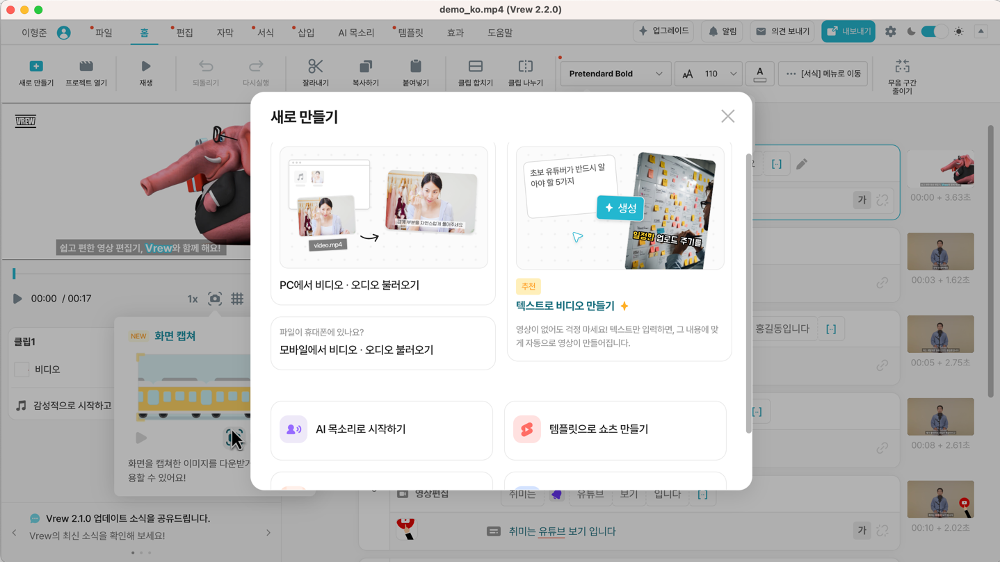
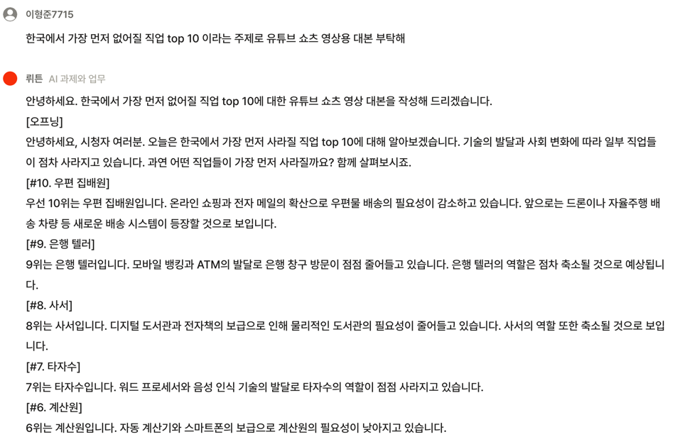
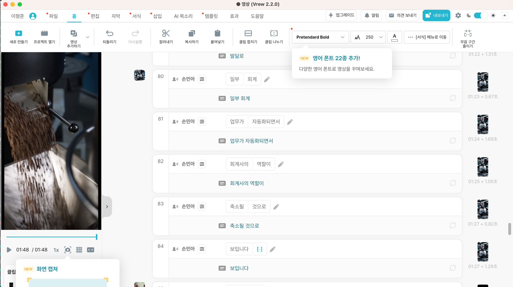

# 동영상을 만들어보자!

## 목표: 개발시 도움만 받는 용도로 사용해봤는데 이번 기회에 친해지고자 사용해봅니다!
## 2화 Vrew
### 딸깍 몇번으로 쇼츠를 만들어보자!

### 쇼츠 동영상 수익을 내보고 싶은데 요즘들어 많이 운영이 되고 있는것 같습니다.
### https://www.youtube.com/watch?v=aS_uXgmL9Ug
### 해당 유튜브를 보고 만들었으며 생각보다 굉장히 3분내로 만들수 있었네요.
### 유튜브 알고리즘에 걸리고자 한다면 물론 영상의 퀄리티도 중요하지만 무엇보다 꾸준히 올릴 수 있는 것이기 때문에 이번 프로젝트간 저의 목적과 부합한 주제였습니다.

### 개인적으로 일단 한달 기준 쇼츠 영상 16개 정도는 무료로도 만들 수 있는 수준이라고 생각듭니다.

### vrew 도 gpt가 탑재되어있어 스크립트 생성이 가능하지만 좀더 커스텀된 모델을 사용하기 위해 대본 스크립터로 훈련중인 뤼튼 모델에서 생성했어요!!
### 이후 생성된 스크립트를 그대로 가져가 영상 만들기 버튼을 누르면 끝!

### 앱 다운로드 후 1분 16초 가량의 쇼츠 영상을 만드는데 총 10분이 소요되지 않았습니다.
### 생각보다 퀄리티또한 훌륭해서 좋은것 같습니다. --> hyeongjune/영상.mp4 올려뒀으니 한번 씩 봐주세요!

## 후기
### 무엇보다 생각 했던 수준의 난이도와 퀄리티대로 나와서 일단 처음 생성한 영상 치고는 굉장히 만족합니다.
### 양산형 쇼츠 유튜버를 꿈꾸는 저에겐 딱 적합한 툴이였으나 최종 목표인 "스크립트 전달 -> 영상 생성 API -> 완료"의 절차로 쓰기엔 제공하는 API가 없어 장기적으로는 사용안할것 같군요!